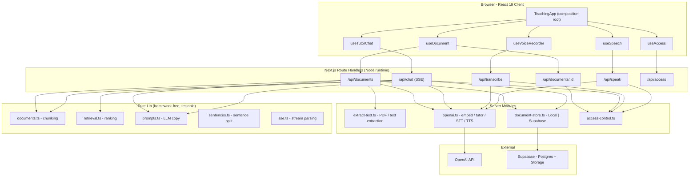
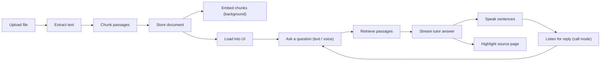
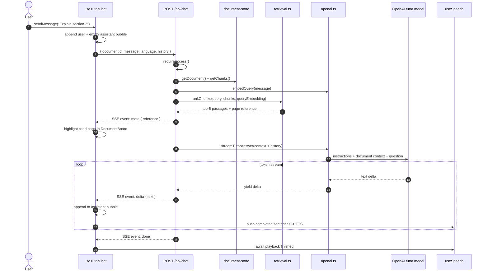
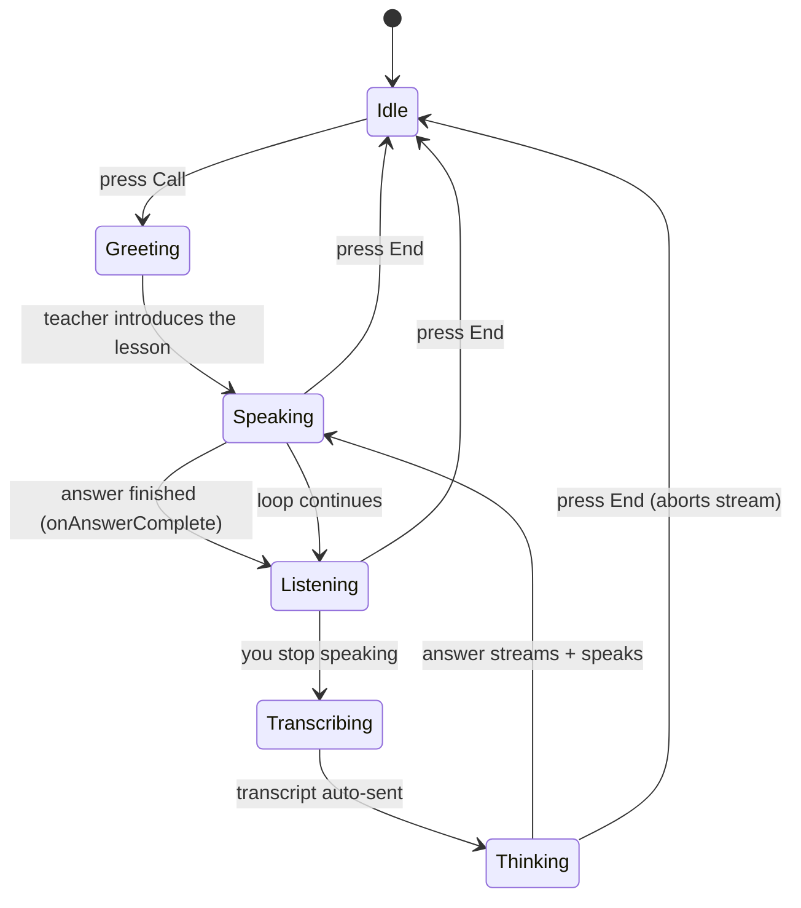
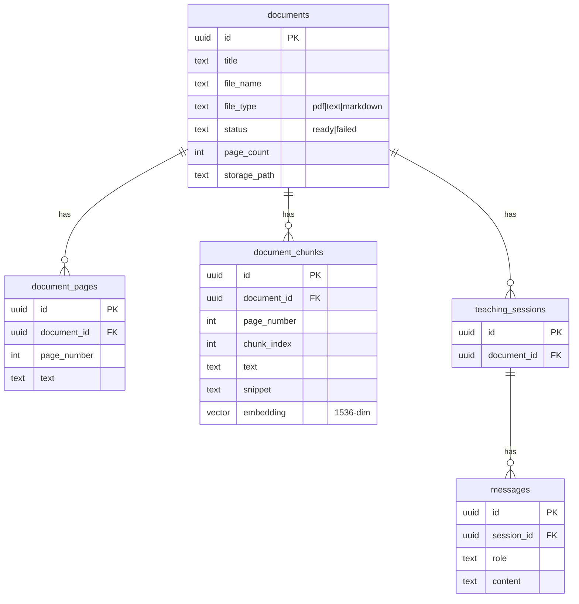
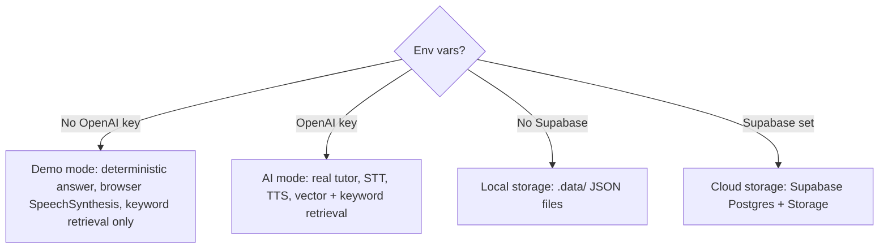

# AI Voice Tutor for Documents

Upload a document, then **learn it by talking to an AI teacher**. The app extracts and chunks
the text, retrieves the most relevant passages for every question, streams a grounded answer,
and speaks it out loud sentence-by-sentence — all in a split-screen workspace where the source
document follows along and highlights what the teacher is referring to.

---

## Table of Contents

1. [What It Does](#what-it-does)
2. [Tech Stack](#tech-stack)
3. [Architecture](#architecture)
4. [Project Structure](#project-structure)
5. [How the Teacher Works — End to End](#how-the-teacher-works--end-to-end)
   - [1. Upload & Processing](#1-upload--processing-what-happens-after-you-upload-a-file)
   - [2. Loading the Document](#2-loading-the-document)
   - [3. Asking a Question → Answer](#3-asking-a-question--answer)
   - [4. Voice In → Voice Out](#4-voice-in--voice-out)
   - [5. Call Mode (Hands-free Loop)](#5-call-mode-hands-free-loop)
6. [Retrieval (RAG) Explained](#retrieval-rag-explained)
7. [API Reference](#api-reference)
8. [Data Model](#data-model)
9. [Run Locally](#run-locally)
10. [Configuration](#configuration)
11. [Supabase Setup](#supabase-setup)
12. [Operating Modes](#operating-modes)
13. [Limits & Roadmap](#limits--roadmap)

---

## What It Does

- **Upload** searchable PDF, `.txt`, or `.md` files (up to 25 MB, up to 300 PDF pages).
- **Extract** PDF text page-by-page (text PDFs only — scanned/OCR PDFs are rejected).
- **Chunk** text into overlapping passages and **embed** them (when an OpenAI key is set).
- **Ask** questions by typing *or by voice* — the answer streams back token-by-token.
- **Ground** every answer in the document via hybrid keyword + vector retrieval.
- **Speak** the answer aloud, synthesizing each sentence as it arrives for low latency.
- **Follow along** — the document board jumps to the cited page and highlights the passage.
- **Call mode** — a hands-free loop: teacher speaks → listens → you reply → repeat.
- **Multi-language** tutoring — pin replies to Japanese, English, Arabic, or auto-detect.
- **Two runtime modes** — full cloud (OpenAI + Supabase) or a zero-dependency **local demo mode**.

---

## Tech Stack

| Layer | Technology |
|-------|------------|
| Framework | Next.js 16 (App Router, RSC + Route Handlers) |
| Language | TypeScript 5.7 (strict) |
| UI | React 19, Tailwind CSS 4, `lucide-react` icons |
| AI | OpenAI SDK 6 — tutor (`gpt-5.4-mini`), embeddings (`text-embedding-3-small`), STT (`gpt-4o-mini-transcribe`), TTS (`gpt-4o-mini-tts`) |
| PDF | `pdfjs-dist` (legacy build) + `@napi-rs/canvas` polyfills |
| Storage | Supabase (Postgres + `pgvector` + Storage) **or** local `.data/` JSON files |
| Streaming | Server-Sent Events (SSE) over `ReadableStream` |
| Tests | Vitest |
| Runtime | Node.js 24.x |

---

## Architecture



**Layering rule:** `lib/` is pure and framework-free (unit-tested in isolation) → `server/`
holds I/O and side effects → `app/api/` route handlers orchestrate → `hooks/` own client
state → `components/` render. Dependencies only point downward.

---

## Project Structure

```
src/
├── app/
│   ├── layout.tsx                 Root layout + metadata
│   ├── page.tsx                   Renders <TeachingApp/>
│   ├── globals.css                Tailwind + app styling
│   └── api/
│       ├── access/route.ts        GET status · POST submit access code
│       ├── documents/route.ts     POST upload + process a file
│       ├── documents/[id]/route.ts        GET metadata + pages + file URL
│       ├── documents/[id]/file/route.ts   GET original file (inline)
│       ├── chat/route.ts          POST → SSE stream of the tutor answer
│       ├── transcribe/route.ts    POST audio → text (speech-to-text)
│       └── speak/route.ts         POST text → MP3 audio (text-to-speech)
├── server/                        Node-only side-effecting modules
│   ├── access-control.ts          Cookie-based access gate
│   ├── extract-text.ts            PDF (pdf.js) + plain-text page extraction
│   ├── document-store.ts          DocumentStore: Local | Supabase impls
│   └── openai.ts                  embed · streamTutorAnswer · STT · TTS
├── lib/                           Pure, framework-free logic (+ unit tests)
│   ├── types.ts                   Shared domain types
│   ├── documents.ts               Upload validation + overlap chunking
│   ├── retrieval.ts               Hybrid keyword + cosine ranking
│   ├── prompts.ts                 Centralized LLM prompts + tuning
│   ├── sentences.ts               Streaming sentence-boundary splitter
│   ├── sse.ts                     SSE frame parsing
│   ├── config.ts                  Env var resolution
│   └── message-format.tsx         Chat markdown + highlight rendering
├── hooks/
│   ├── use-access.ts              Access gate state
│   ├── use-document.ts            Upload, processing, active page, highlight
│   ├── use-tutor-chat.ts          Chat stream → messages + TTS feed
│   ├── use-speech.ts              Ordered sentence-by-sentence TTS playback
│   └── use-voice-recorder.ts      Mic capture → transcription
└── components/teaching/
    ├── TeachingApp.tsx            Composition root, wires all hooks
    ├── AccessScreen.tsx           Access-code lock screen
    ├── UploadPanel.tsx            Drag-and-drop upload surface
    ├── DocumentBoard.tsx          PDF iframe / extracted-text viewer
    ├── TeacherPanel.tsx           Avatar, transcript, call controls
    ├── TeacherAvatar.tsx          Animated SVG teacher
    ├── Splitter.tsx               Draggable pane divider
    └── ConfirmDialog.tsx          Accessible confirm modal

supabase/schema.sql                Postgres + pgvector schema
```

---

## How the Teacher Works — End to End

This is the heart of the project: the full path from **uploading a file** to **hearing a
spoken, document-grounded answer**.



### 1. Upload & Processing (*what happens after you upload a file*)

When you drop a file on `UploadPanel`, `useDocument.uploadFile()` POSTs it to
`/api/documents`. The server runs this pipeline:

```mermaid
sequenceDiagram
    autonumber
    actor User
    participant UP as UploadPanel
    participant UD as useDocument
    participant API as POST /api/documents
    participant EX as extract-text.ts
    participant CH as documents.ts (chunk)
    participant DS as document-store.ts
    participant OA as openai.ts
    participant EXT as OpenAI / Supabase

    User->>UP: Drop or pick a file
    UP->>UD: uploadFile(file)
    UD->>API: multipart/form-data { file }
    API->>API: requireAccess() - cookie gate
    API->>API: validateUploadFile() (<=25MB, .pdf/.txt/.md)
    API->>EX: extractPagesFromUpload(buffer, kind)
    alt PDF
        EX->>EX: pdf.js -> text per page; reject scanned / >300 pages
    else Text / Markdown
        EX->>EX: split into ~5000-char pages
    end
    EX-->>API: DocumentPage[]
    API->>CH: chunkDocumentPages(pages)
    CH-->>API: DocumentChunk[] (~1600 chars, 220 overlap)
    API->>DS: saveProcessedDocument() (embeddings = null)
    DS->>EXT: write file + rows (Supabase) or .data/ JSON
    API-->>UD: 200 { documentId, status }
    Note over API,OA: after() - runs AFTER the response is sent
    API->>OA: embedTexts(chunk texts)
    OA->>EXT: OpenAI embeddings (batched, concurrent)
    OA-->>DS: updateChunkEmbeddings()
```

**Key design choices:**

- **Validation first** — file size (≤ 25 MB), type (`.pdf` / `.txt` / `.md`), and — for
  PDFs — page count (≤ 300) and the presence of extractable text. Scanned/image-only PDFs
  are rejected (no OCR in the MVP).
- **Page extraction** — PDFs go through `pdf.js`; plain text/markdown is sliced into
  ~5000-char "pages" on paragraph/sentence boundaries so the viewer still paginates.
- **Overlap chunking** — pages are split into ~1600-char chunks with ~220-char overlap,
  cutting on sentence boundaries where possible so retrieved passages stay coherent.
- **Embeddings are deferred** — the document is saved *immediately* with `embedding: null`
  and the response returns right away. Embeddings are computed in a Next.js `after()`
  background task. **You can start learning before embeddings finish** — retrieval simply
  falls back to keyword ranking until the vectors land.

### 2. Loading the Document

After upload, `useDocument` calls `GET /api/documents/:id`, which returns the document
record, every extracted page, and a `fileUrl`. The UI swaps from `UploadPanel` to the
split-screen workspace:

- **Left — `DocumentBoard`:** the original PDF in an `<iframe>` (`#page=N` deep-link), or
  the extracted page text for `.txt`/`.md`, with a paragraph that the teacher can highlight.
- **Right — `TeacherPanel`:** the animated avatar, the conversation transcript, the
  language picker, and the **Call** / mic / restart controls.

### 3. Asking a Question → Answer



**What makes the answer trustworthy and fast:**

- **Grounded:** the system prompt (`prompts.ts`) instructs the tutor to teach *only* from
  the supplied document context and to say so plainly when the document lacks the answer.
- **Cited:** the top-ranked chunk becomes a `reference` (page number + snippet), sent as
  the first SSE `meta` event so the document board can jump and highlight *before* the
  answer text even starts.
- **Streamed:** the answer arrives token-by-token over SSE; the UI renders it live and the
  speech layer starts talking after the *first sentence*, not the whole reply.
- **Tuned for voice:** `reasoningEffort: "none"` and a 700-token cap (`prompts.ts`) keep
  time-to-first-word low — critical for a conversational feel.

### 4. Voice In → Voice Out

**Speech → text (`useVoiceRecorder`):** the mic records one clip with `MediaRecorder`, uploads
it to `/api/transcribe`, and OpenAI STT returns text — which is auto-sent as a question.

**Text → speech (`useSpeech`):** as the answer streams, `sentences.ts` pulls each *complete*
sentence out of the buffer. Each sentence is POSTed to `/api/speak`, which returns an MP3.
The clever part:

- Synthesis for sentence *N+1* **starts while sentence *N* is still playing** (overlapped).
- A promise **chain** guarantees clips play **strictly in order**, even if a later fetch
  resolves first.
- A **monotonic session id** + `AbortController` invalidate every in-flight fetch and clip
  the instant the user interrupts or ends the call.
- If no OpenAI key is configured, playback **falls back** to the browser's
  `SpeechSynthesis`.

### 5. Call Mode (Hands-free Loop)

Pressing **Call** starts a continuous, no-typing conversation loop:



On the first call the teacher speaks a hidden **greeting prompt**; after each answer
finishes, `onAnswerComplete` re-opens the mic (after a 350 ms gap so the audio device is
released). Pressing **End** aborts the chat stream, the transcription, and TTS in one shot.

---

## Retrieval (RAG) Explained

`retrieval.ts` ranks every chunk with a **hybrid score** so the app works with *or* without
embeddings:

| Component | How | When |
|-----------|-----|------|
| **Keyword score** | Tokenize the query (drop stop-words), count term occurrences in the chunk, with a phrase-match bonus | Always |
| **Vector score** | Cosine similarity between the query embedding and the chunk embedding, weighted ×2 | Only when both embeddings exist |

`final = keyword + (vector × 2)` when a vector is available, else `keyword` alone. The top
5 chunks become the LLM context; the top 1 becomes the highlighted page reference. This is
why the app stays useful in local demo mode and *before* background embeddings finish.

> **Note:** `supabase/schema.sql` also ships a `match_document_chunks` pgvector RPC and an
> `ivfflat` index. The current code does in-memory JS ranking and does **not** call that
> RPC — see the code review (`ARCH-001`). It is reserved for a future DB-side retrieval path.

---

## API Reference

All routes run on the **Node.js runtime**. Mutating/data routes are gated by `requireAccess()`.

| Method | Route | Purpose |
|--------|-------|---------|
| `POST` | `/api/documents` | Upload one file → validate, extract, chunk, store; embed in background. Returns `{ documentId, status }`. |
| `GET` | `/api/documents/:id` | Fetch `{ document, pages, fileUrl }`. |
| `GET` | `/api/documents/:id/file` | Serve the original file inline (local buffer or redirect to a signed Supabase URL). |
| `POST` | `/api/chat` | Stream the tutor answer as SSE. Body: `{ documentId, message, language, messages[] }`. |
| `POST` | `/api/transcribe` | `multipart/form-data` audio (≤ 8 MB) → `{ text }`. |
| `POST` | `/api/speak` | `{ text }` (≤ 4000 chars) → `audio/mpeg` MP3. |
| `GET` | `/api/access` | `{ required, granted }`. |
| `POST` | `/api/access` | `{ code }` → sets the access cookie. |

**`/api/chat` SSE events:** `meta` (page reference) → `delta`* (text tokens) → `done`, or
`error` on failure.

---

## Data Model



In **local mode** the same shape is stored as JSON files under `.data/` (`documents.json`,
`pages/<id>.json`, `chunks/<id>.json`) with the raw file under `.data/uploads/`.

> `teaching_sessions` and `messages` exist in the schema but are not yet read/written by the
> app — chat history currently lives only in client memory (see code review `ARCH-002`).

---

## Run Locally

```bash
npm install
cp .env.example .env.local
npm run dev
```

Open `http://localhost:3000`.

Without an `OPENAI_API_KEY` the app still demonstrates the full upload → retrieval →
highlight flow and returns a **deterministic demo answer** spoken via the browser's voice.

| Script | Purpose |
|--------|---------|
| `npm run dev` | Start the dev server |
| `npm run build` | Production build |
| `npm start` | Run the production build |
| `npm test` | Run Vitest once |
| `npm run test:watch` | Vitest in watch mode |
| `npm run typecheck` | `tsc --noEmit` |

---

## Configuration

All config resolves through `src/lib/config.ts`.

| Variable | Default | Purpose |
|----------|---------|---------|
| `OPENAI_API_KEY` | — | Enables real AI (tutor, embeddings, STT, TTS). Omit → demo mode. |
| `OPENAI_TUTOR_MODEL` | `gpt-5.4-mini` | Tutor chat model |
| `OPENAI_EMBEDDING_MODEL` | `text-embedding-3-small` | Chunk/query embeddings |
| `OPENAI_TRANSCRIBE_MODEL` | `gpt-4o-mini-transcribe` | Speech-to-text |
| `OPENAI_SPEECH_MODEL` | `gpt-4o-mini-tts` | Text-to-speech |
| `OPENAI_SPEECH_VOICE` | `alloy` | TTS voice |
| `SUPABASE_URL` | — | Supabase project URL |
| `SUPABASE_SERVICE_ROLE_KEY` | — | Service-role / secret key (**not** the anon key) |
| `SUPABASE_STORAGE_BUCKET` | `teaching-documents` | Storage bucket name |
| `APP_ACCESS_CODE` | — | If set, all API routes require this code |

If only one of the two Supabase variables is set, or the key is not a service-role key,
the app refuses to start with a clear error.

---

## Supabase Setup

1. Create a Supabase project.
2. Run [`supabase/schema.sql`](./supabase/schema.sql) in the SQL editor.
3. Create a **private** storage bucket named `teaching-documents`.
4. Set `SUPABASE_URL`, `SUPABASE_SERVICE_ROLE_KEY`, and `SUPABASE_STORAGE_BUCKET`.

If the Supabase variables are absent, the app automatically uses local `.data/` storage.

---

## Operating Modes



The two axes are independent: you can run **AI mode + local storage**, **demo mode + cloud
storage**, etc. — whatever the configured env vars support.

---

## Limits & Roadmap

**Current limits**

- Max file size: **25 MB**.
- Max PDF length: **300 pages**.
- PDF support is **text extraction only** — no OCR for scanned documents.
- Chat history lives in client memory; sessions are not yet persisted.

**Phase 2 (not yet built)**

- Realtime always-on microphone, DOCX support, video/lip-sync avatars.
- In-app quizzes and progress tracking.
- Multi-user document libraries and persisted teaching sessions.
- DB-side pgvector retrieval via the `match_document_chunks` RPC.

---

## Code Quality

A full multi-dimensional code review lives at
[`.workflow/.scratchpad/review-report.md`](./.workflow/.scratchpad/review-report.md):
**0 critical, 1 high, 6 medium** — quality gate **PASS**. Headline items: add tests for the
server/API/hook layers, and reconcile schema/code drift (`match_document_chunks`,
`teaching_sessions`/`messages` are defined but unused).
